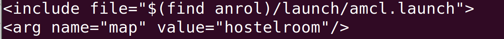

# ANROL

### Autonomous Navigation Robot using Laser Odometry

This robot uses rf2o laser odometry as its primary odometry source instead of using inertial odometry.

### Packages Used:

- AMCL for localization
- RPLidar A1 ROS Package
- rf2o_laser_odometry for Odometry
- Hector_slam for mapping

## Setup

All commands written below corresponds to ROS Noetic Version. For any other version, replace Noetic with your version.

- Install RPLidar A1 Package

```bash
sudo apt-get install ros-noetic-rplidar-ros
```

- Clone rf2o laser package in your catkin workspace

```bash
cd ~/catkin_ws/src
git clone https://github.com/tianb03/rf2o_laser_odometry
```

- Install hector_slam

```bash
roslaunch install ros-noetic-hector_slam
```

## Startup

### Run RPLidar node

To start the project, open a new terminal and the rplidar node.

```bash
roslaunch rplidar_ros rplidar.launch
```

### Start Mapping

To map your environment, start the hector slam tutorial node.

```bash
roslaunch hector_slam_launch tutorial.launch
```

This will open a RViZ window.

Once the map is created, save it to the maps folder using map server

```bash
rosrun map_server map_saver ~/catkin_ws/src/anrol/maps/{name_of_map}
```

### Navigating the robot in the saved map

To navigate your robot in the saved map (by above step), launch the navigate.launch file.

******************Before launching the file,****************** open navigate.launch and change the map parameter to your saved map name. 



change the value of the argument map to your map name

After this is done, launch the navigate.launch file

```bash
roslaunch anrol navigate.launch
```

This should open a RViZ window where 2D Nav Goal can be used to give a goal to the robot. 

### Some Misc Info

For the above code, ************************be careful with the frame names. Change the frame names according to your setup.************************ 

For this project, the frames are set as below: 

**Base Frame**: base_footprint

**Laser Frame**: laser

**Odom Frame**: odom

**global frame**: map
